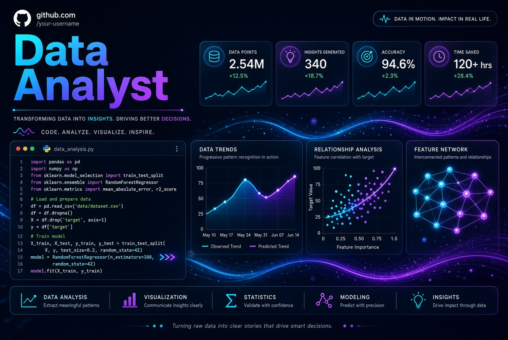

  

---

## Bonjour, je suis RAZANAKOTO **Lovatahiana** 👋

**Data Analyst Freelance** spécialisé en Python, SQL et visualisation de données.

Je transforme les données complexes en insights clairs et actionnables pour aider les entreprises à prendre de meilleures décisions.

---

### 🛠️ Compétences
- **Langages** : Python, SQL
- **Outils** : Pandas, NumPy, Matplotlib, Seaborn, Plotly, Power BI
- **Autres** : Jupyter, Git, Excel avancé

---

### 📌 Projets phares
- [Nom du projet 1](lien) → Courte description + résultat
- [Nom du projet 2](lien) → Courte description + résultat
- [Nom du projet 3](lien) → Courte description + résultat

---

### 🔗 Me contacter
[LinkedIn](https://www.linkedin.com/in/razanakoto-lovatahiana-nomenjanahary-4060aa2a6/) • [Email](lonaloraz@gmail.com) • [facebook](https://www.linkedin.com/in/razanakoto-lovatahiana-nomenjanahary-4060aa2a6/) • [X](https://x.com/lonaloraz)
